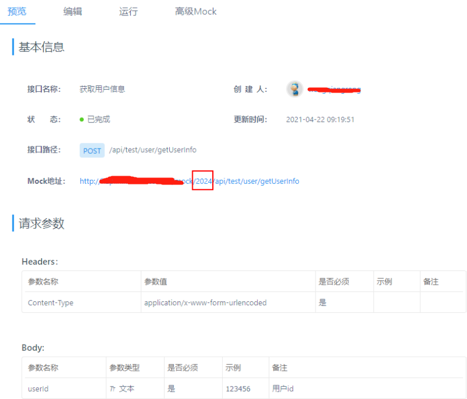
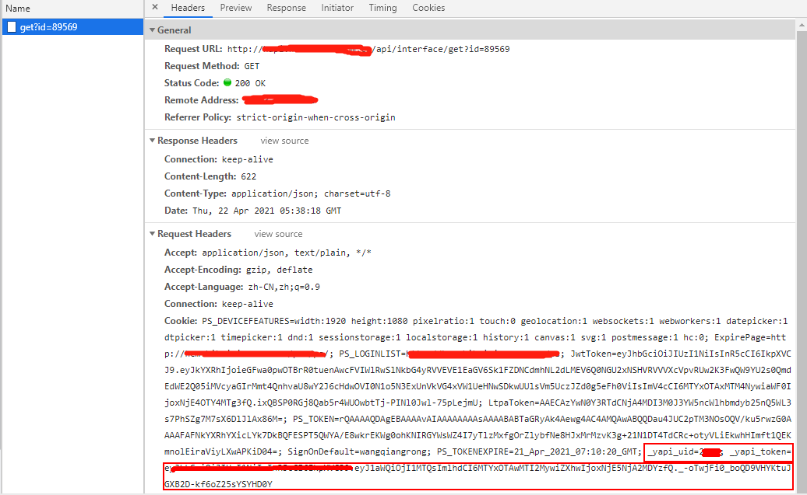
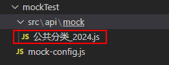
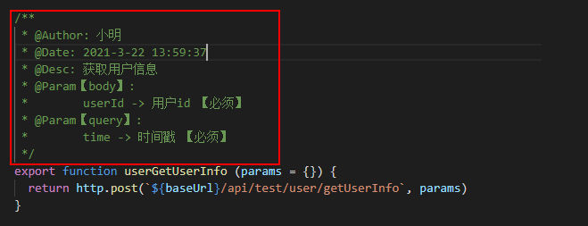
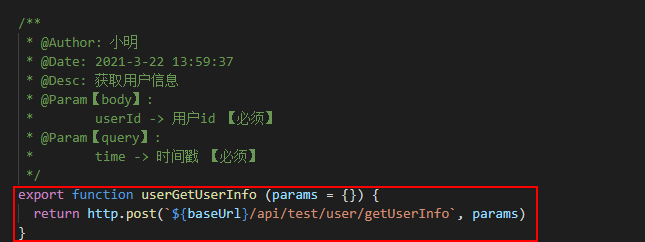
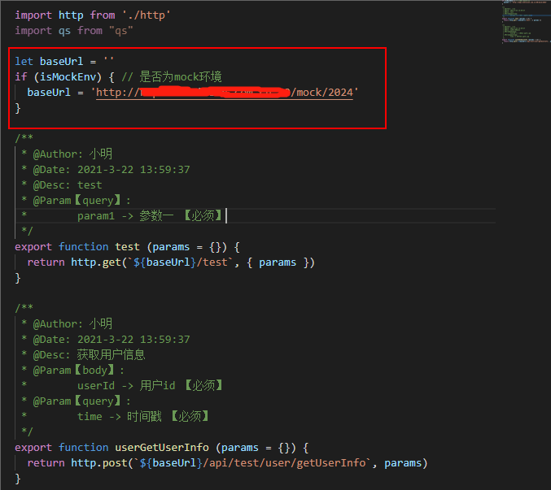
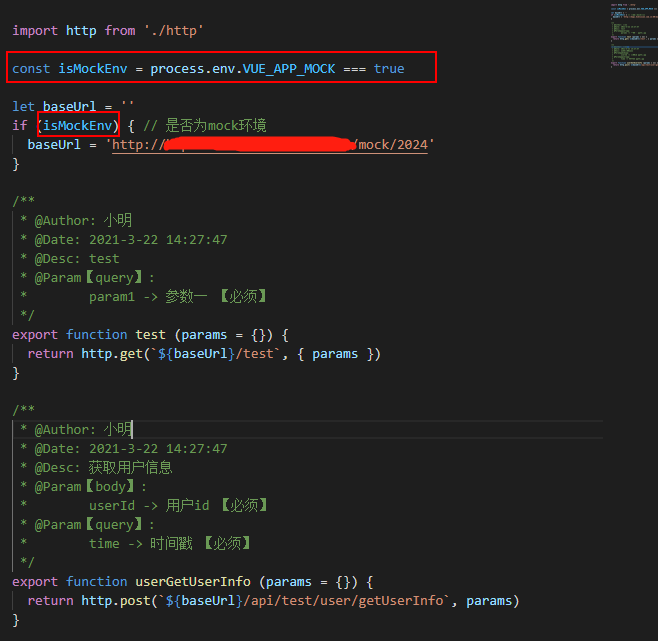

# mock-config配置

## projectId

### 释意

yapi平台上面的项目id【必填】

### 说明

可配置字符串【单个项目】和数组【多个项目】如：'2024' ， ['2024','2024']

:::tip
可从接口的地址中获取，如下图：
:::




## host

### 释意

yapi平台地址【必填】

### 说明

默认值：yapi.test.com

## port

### 释意

yapi平台端口【必填】

### 说明

默认值：80

## cookie

### 释意

登录yapi平台后生成的cookie【必填】

### 说明

:::tip
登录后可打开浏览器面板的cookie项中获取，可从任意请求中获取，如下图：
:::



## dest

### 释意

接口文件生成的目标文件夹【非必填】

### 说明

若目标文件夹不存在则自动生成

:::tip
生成后的接口文件名称格式为：分组名称_projectId.js，如下图：
:::

### 示例

#### 配置

```js
dest: './src/api/mock'
```

#### 生成结果



## baseTemplate

### 释意

基础内容，展示在接口文件顶部【非必填】

### 说明

**非必填，不填则使用工具预设的默认值**

在日常开发中每个接口文件的头部，可能都会引入封装好的请求方法，如下： 

```js
import http from './http'
```

那么，就能在该配置项中进行配置，此外还能定义其他任意代码，工具都将自动生成到文件中。比如，需要接口文件的头部展示如下内容：

```js
import http from './http'
import qs from "qs"
```

### 示例

#### 配置

```js
baseTemplate: `
import http from './http'
import qs from "qs"
`
```

#### 生成结果

```js
import http from './http'
import qs from "qs"
```

## notesTempalte

### 释意

注释模板，用于生成每个请求方法的注释【非必填】

### 说明

**非必填，不填则使用工具预设的默认值**

在该配置中可以选择是否注入dateTime【时间】，name【接口名称】，bodyParams【请求主体参数】，queryParams【url拼接参数】四个动态内容，可按照自己自定义的格式控制其展示位置，工具会将对应的最终值替换掉指定的位置。其他的可自己写死，比如：开发者名称

:::tip
注意：

1：要注入的字段，请按照规定的格式进行配置，如:[dateTime]

2：bodyParams，queryParams的配置需紧跟上一行，否则生成的注释中会多出一个空白行
:::

### 示例

#### 配置

```js
notesTempalte: `
/**
 * @Author: 小明
 * @Date: [dateTime]
 * @Desc: [name][bodyParams][queryParams]
 */
`
```

#### 生成结果




## postTemplate

### 释意

post方法模板，用于生成post请求方法【非必填】

### 说明

**非必填，不填则使用工具预设的默认值**

在该配置中需要注入requestName【请求名称】，method【请求方法类型】，requestUrl【接口地址】三个动态内容。

:::tip
1：要注入的字段，请按照规定的格式进行配置，如:[requestName]

2：requestName是取原接口地址的最后两段字母拼接成的。比如原接口地址为“/api/test/user/getUserInfo”，那么工具将取user和getUserInfo拼接成userGetUserInfo作为方法名
:::

### 示例

#### 配置

```js
postTemplate: `export function [requestName] (params = {}) {
  return http.[method]([requestUrl], params)
}
`
```

#### 生成结果



## getTemplate

【非必填】【同postTemplate】

## 最终效果



:::tip
1：上图中圈起来的内容是工具自动注入的，开发者无需手动去获取接口完整地址的前缀；
2：图中的isMockEnv字段是用来判断是否需要调用mock接口用的，该字段的来源不确定性较大，所以需要开发者自己在baseTemplate中定义，如下所示：
:::

#### 配置

```js
baseTemplate: `
import http from './http'

const isMockEnv = process.env.VUE_APP_MOCK === true
`,
```

#### 生成结果

